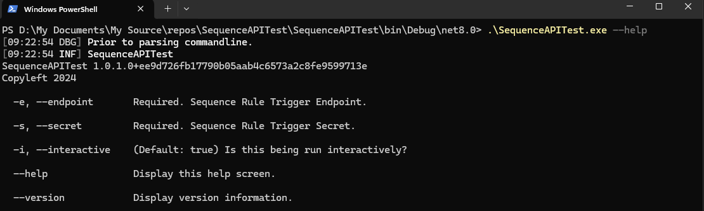
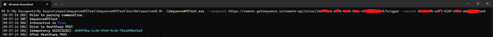
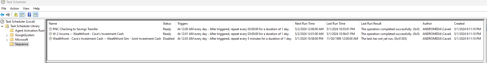
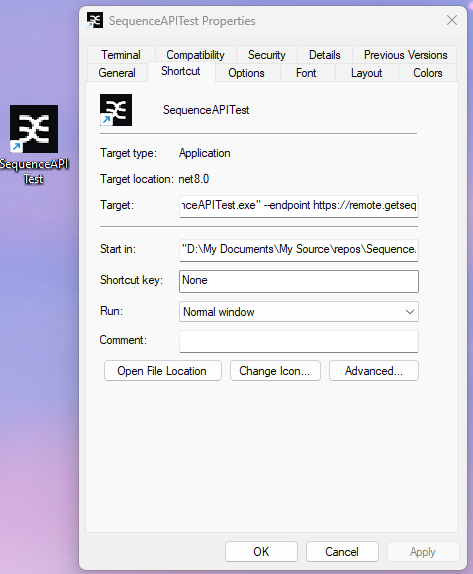

# SequenceAPITest

This is a simple console app to excercise the Sequence Remote API Endpoint that triggers a rule to run.

## Description

This application can be run with a trigger URL and API secret of Sequence rules to trigger them immediately.

### Features

- Calls a Restful endpoint that triggers a rule to execute in Sequence.

### Built with

- C#
- RestSharp

## Getting started

### Prerequisites

N/A.

### Install

Install by running the MSI file: <a href="SequenceAPITest Installer.msi" download>Click to Download</a>

### Configure

N/A.

### Usage

- Run interactively from the command line.

- Schedule to run repeatedly using Windows Task Scheduler.

- Create a shortcut to the command line passing arguments.

### Acknowledgements

Thanks to [RestSharp - Simple .NET REST Client](https://github.com/restsharp/RestSharp?tab=readme-ov-file#restsharp---simple-net-rest-client) developers.

### To-do

- [X] Add Idempotency UUID(GUID) generated automatically to constrain the request.
- [ ] Add additional specific response driven error handling

### License

This project is licensed under the [GPL-3.0 License](LICENSE.txt).